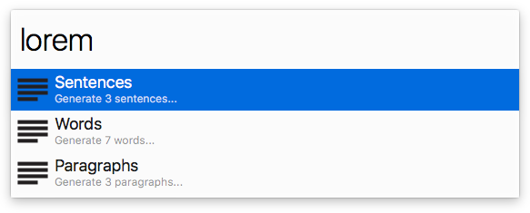

# Lorem Ipsum Workflow for Alfred

An ultra-fast Lorem Ipsum workflow for Alfred 4.



## Installation

1. [Download the latest version](https://github.com/tillkruss/alfred-lorem-ipsum/releases/download/v0.2.1/Lorem.Ipsum.alfredworkflow)
2. Install the workflow by double-clicking the `.alfredworkflow` file
3. You can add the workflow to a category, then click "Import" to finish importing. You'll now see the workflow listed in the left sidebar of your Workflows preferences pane.

## Usage

```
lorem words <number>
lorem sentences <number>
lorem paragraphs <number>
```

Just type `lorem` followed by either `words`, `sentences` or `paragraphs` and optionally a number.

Instead of typing you may of course use Alfred's hotkeys to navigate faster.
